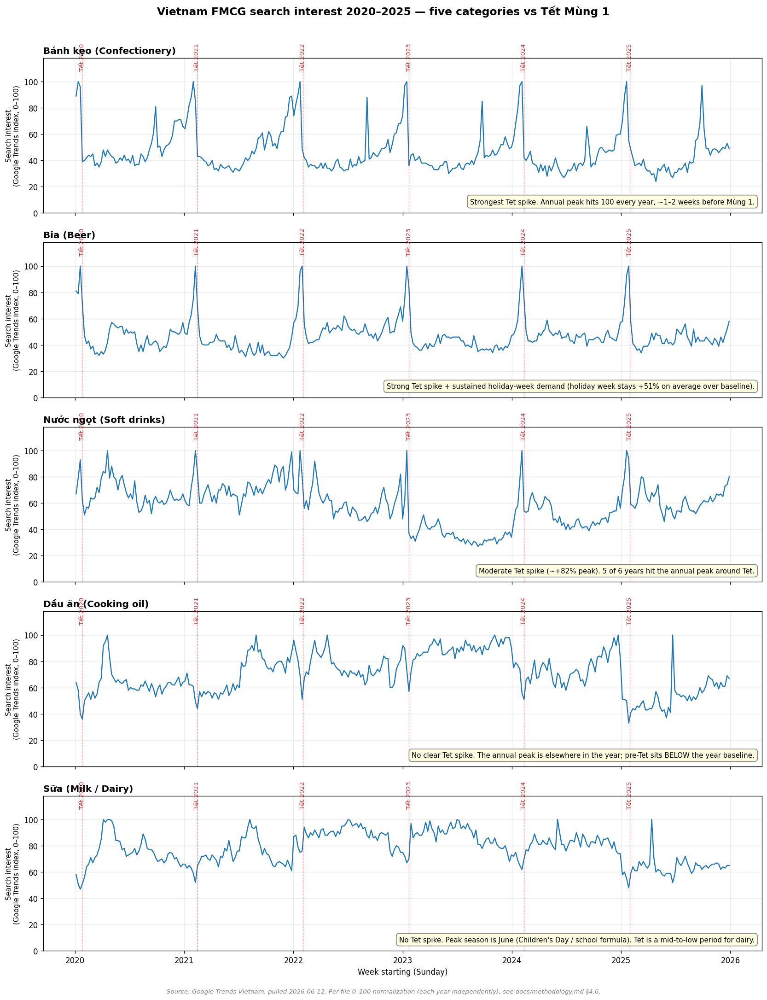
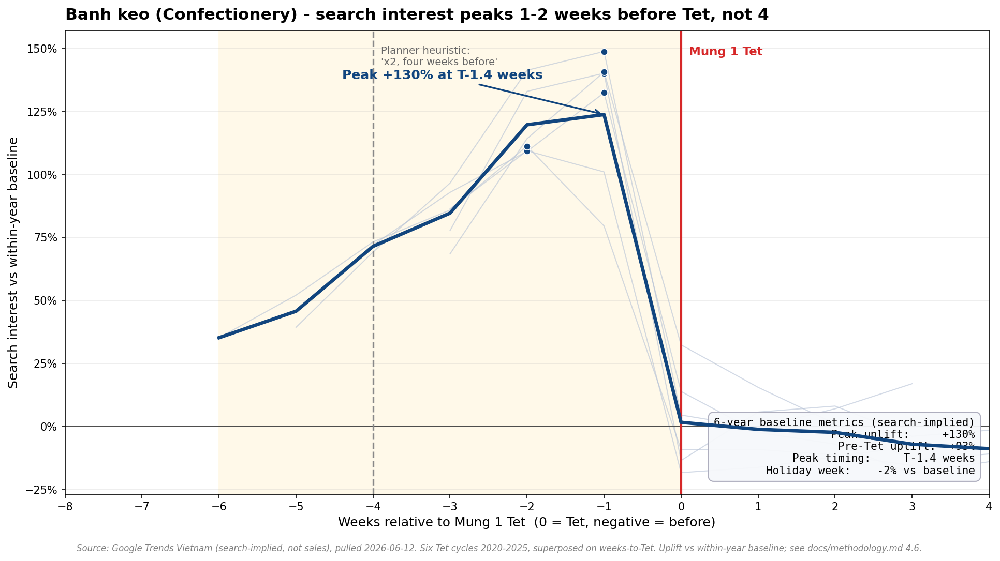
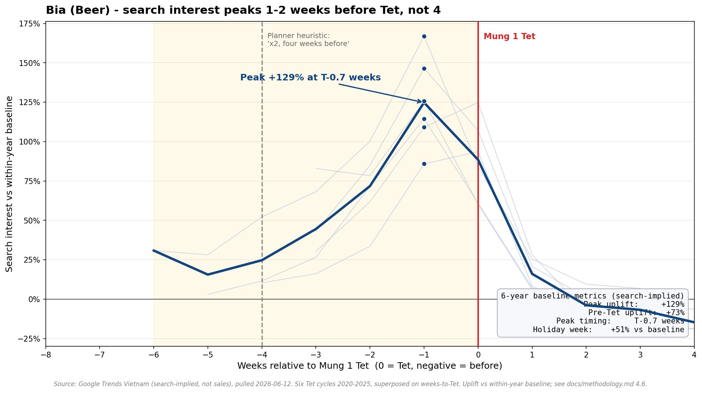
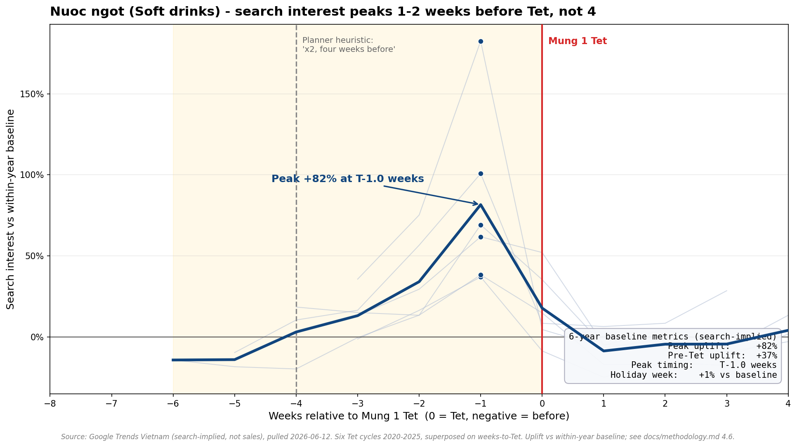
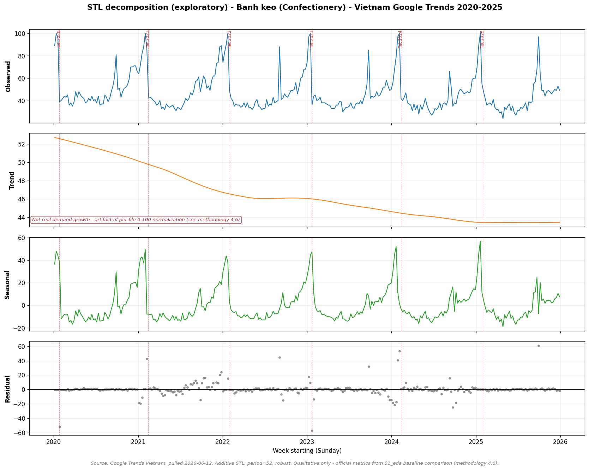

# Quantifying the Tết Effect in Vietnamese FMCG Demand

### A search-implied, per-category framework for demand planners

**Author:** Pham Le Quang Huy
**Version:** 1.0 — June 2026
**Repository:** <https://github.com/phamlequanghuy/vn-fmcg-tet-effect>

---

## Executive Summary

Vietnamese FMCG demand planners have long worked around Tết (Lunar New Year) with a single rule of thumb — roughly *"double demand four weeks before Tết, cut it to a third two weeks after."* It is memorable, it is decades old, and it is applied more or less uniformly across categories. This paper tests that mental model against six years of weekly data and finds it is right in spirit but wrong in three specific, plannable ways.

Using weekly Google Trends search interest for Vietnam across six Tết cycles (2020–2025) and five FMCG categories, measured as uplift relative to each category's own non-Tết baseline, four findings stand out:

1. **The Tết effect is not blanket — it concentrates in three of five categories.** Confectionery (`bánh kẹo`, **+130%** peak uplift), beer (`bia`, **+129%**), and soft drinks (`nước ngọt`, **+82%**) show a strong, repeatable Tết spike. Cooking oil (`dầu ăn`) and dairy (`sữa`) show **none** — their pre-Tết weeks sit *below* their own annual baseline because their real peak season lies elsewhere (dairy peaks in June).

2. **The spike peaks one to two weeks before Tết, not four.** The weekly peak lands at T − 1.4 weeks (confectionery), T − 1.0 week (soft drinks), and T − 0.7 weeks (beer). The familiar four-week mark is likely when elevated demand *begins*; the true crest is in the final fortnight.

3. **Categories behave differently *during* the holiday week — beer is the outlier.** Confectionery dips slightly (−2%) once the holiday arrives (it is a pre-stock category), while beer stays elevated **+51% above baseline through the holiday week itself** (a consumption category). They need different replenishment logic.

4. **Confectionery has a second annual season.** A robust September search spike points to Tết Trung Thu (Mid-Autumn / mooncake) — confectionery is a two-season category, not a Tết-only one.

**The central implication for planners:** replace the single uniform Tết rule with a *per-category, shape-aware* plan — category-specific lead times, a later replenishment crest, segmentation by pre-stock vs in-holiday consumption, and year-by-year stress-testing rather than blended averages. Every number here is **search-implied**, intended as a directional benchmark to validate against your own internal sales — not a replacement for it. The full analysis, code, and figures are public and reproducible.

---

## 1. Context & Problem

### 1.1 Tết is the single largest annual disruption to Vietnamese FMCG demand

Tết Nguyên Đán reshapes consumption in Vietnam more than any other event in the calendar. In the weeks before Mùng 1, households stock up on gifts, food, drink, and confectionery; during the holiday itself, normal retail rhythm collapses and gathering-centred consumption takes over; and for weeks afterward demand drifts back toward normal. For anyone planning supply, the swing is enormous, it is annual, and getting it wrong is expensive in both directions — stockouts during the most important sales window of the year, or costly excess inventory left over once the holiday passes.

Two features make Tết harder to plan than a fixed Western-calendar peak. First, **its date moves.** Tết follows the lunar calendar, so Mùng 1 drifts across the Gregorian calendar by up to three weeks from year to year (22 January in 2023, 12 February in 2021). A plan anchored to a fixed week of the year will be early some years and late others. Second, **its effect is uneven.** Intuition says "Tết lifts everything," but categories differ sharply in how much they spike, when they peak, and how they behave once the holiday arrives — and that variation is exactly what a uniform rule cannot capture.

### 1.2 The twenty-year heuristic — useful, but unquantified

In the absence of a public, per-category baseline, Vietnamese demand planning has leaned for decades on a shared heuristic: something close to *"x2 demand four weeks before Tết, x0.3 demand two weeks after."* This rule has real value — it encodes hard-won practitioner experience, it is easy to communicate, and it is directionally correct. But it has three weaknesses that matter operationally. It is **uniform** (one multiplier for every category, when categories plainly differ), it is **approximate on timing** (a single "four weeks" mark for a build-up that peaks at different points), and it is **unvalidated in public** (no shared, auditable evidence base behind the numbers). Planners apply it because it is the best tool available, not because it has been measured.

### 1.3 Why a quantitative baseline has been missing

The reason the heuristic was never replaced with measured, per-category figures is straightforward: the data to do so is not publicly available at the resolution required. Category-level Vietnamese FMCG sales are not published at weekly granularity. The General Statistics Office publishes retail trade series, but they are monthly and aggregated well above the FMCG-category level. The syndicated panels that *would* resolve the question — Nielsen Vietnam, Kantar Worldpanel — sit behind paywalls priced for large manufacturers, out of reach for an open, shareable reference. The result is an industry-wide reliance on a rule of thumb that no one has been able to check against weekly, per-category evidence in public.

### 1.4 What this paper does

This paper builds that missing baseline from a source that *is* public, weekly, and reproducible: Google Trends search interest for Vietnam. It quantifies, per category, how large the Tết spike is, when it peaks, and how each category behaves through the holiday week — across six Tết cycles. The signal is a demand *proxy*, not sales, and the paper is deliberately explicit about what that does and does not allow (Section 2). The goal is not to replace a planner's internal sales data, but to give the industry a shared, auditable, per-category reference where previously there was only a rule of thumb.

---

## 2. Methodology

### 2.1 Data source and why it is fit for purpose

This study measures the Tết (Lunar New Year) demand pattern across five Vietnamese FMCG categories using **weekly Google Trends search-interest data for Vietnam**, covering six Tết cycles from 2020 to 2025. Five category keywords are analysed: `bia` (beer), `bánh kẹo` (confectionery), `nước ngọt` (soft drinks), `dầu ăn` (cooking oil), and `sữa` (milk/dairy).

Google Trends was chosen after the originally-intended sources proved unworkable at the required resolution. Category-level Vietnamese FMCG sales are not published at weekly granularity: General Statistics Office retail series are monthly and aggregated well above the FMCG-category level, and the Nielsen and Kantar Worldpanel category reports that would resolve this are paywalled. Google Trends, by contrast, is free, public, weekly, reproducible, and available consistently across all six years — the properties a planner needs to audit and rerun the analysis independently. We treat its limitations openly rather than disguise them (Section 2.5).

### 2.2 Core assumption — what the signal does and does not claim

The framework rests on a single, deliberately narrow assumption:

> **The *shape* of category search interest over time approximates the *shape* of category demand over the same period.**

We do **not** claim that the Google Trends index equals sales volume. We claim only that when search interest for a category rises and falls through the year, demand for that category tends to rise and fall in a similar pattern. This is sufficient because the Tết effect is a *relative* measurement — how far demand departs from a category's own normal level — not an absolute one. Three conditions support the assumption: Vietnamese consumers search around purchase decisions (comparing brands, checking prices, looking up recipes); seasonal peaks and troughs in search plausibly track seasonal peaks and troughs in buying; and with roughly 78% of Vietnam online and Google dominant, the signal reflects a meaningful, if urban-skewed, slice of consumers.

Every result in this paper should therefore be read as a **search-implied** Tết effect: a directional, shape-based indicator to validate against your own internal sales data — not a substitute for it.

### 2.3 Defining the Tết windows

Tết falls on a different Gregorian date each year, so all timing is measured **relative to Mùng 1** (Lunar Jan 1), denoted `T`. For each year we anchor on the actual Gregorian date of `T` and define three windows:

- **Pre-Tết build-up:** `T − 6 weeks` to the day before `T` — where stocking-up concentrates.
- **Tết holiday week:** `T` to `T + 7 days` — when most retail runs at low intensity.
- **Post-Tết recovery:** `T + 8 days` to `T + 4 weeks` — demand returning to normal.

The **baseline** for each year is that same year's weeks *outside* the build-up, holiday, and recovery windows — in other words, the category's ordinary, non-Tết level. The 6-weeks-before / 4-weeks-after span is the industry planning horizon (the familiar "x2 four weeks before, x0.3 two weeks after" heuristic), adopted as the default and validated against the data during exploratory analysis.

### 2.4 Why per-file normalization does not undermine the numbers

This is the methodological point most worth understanding, because it determines which comparisons are legitimate.

Google Trends does not return absolute search counts. Each export is rescaled to **0–100 against its own maximum**. Because the data was collected as one file per (keyword, year), each of the 30 files is normalized independently. The practical consequence: a value of "80" for beer in 2024 and "80" for beer in 2020 are **not** the same amount of real searching, and "80" for beer and "80" for confectionery are not comparable either. Raw index *levels* cannot be compared across years or across categories.

This sounds fatal but is not, because **every metric in this paper is a ratio measured inside a single file**, against that file's own baseline. Normalizing a file is mathematically the same as multiplying every number in it by some unknown constant. When you divide the Tết-window average by the baseline average from the *same* file, that constant appears in both the numerator and the denominator and cancels out completely. The uplift percentage is therefore unaffected by the normalization.

In plain terms: we cannot say "beer was searched more in 2024 than in 2020," but we *can* say something like "beer search jumped 87% above its own 2024 normal, versus 75% above its own 2020 normal" (these two figures are **illustrative examples** to show the logic, not measured results — the actual six-year beer figures are in Table 3.1). The second statement — uplift relative to each category's own baseline — is exactly what a planner needs, and it is fully valid. Consequently, all figures in this paper are expressed as **percentage uplift or dip relative to the within-year baseline**, never as a raw index level. Cross-category *rankings* by uplift % are valid for the same reason: each side of the comparison uses its own baseline as the denominator.

### 2.5 Limitations to keep in view

We publish the constraints alongside the findings:

1. **Search is not purchase.** Search captures interest, not transactions; the proxy is stronger for deliberated categories (gift sets, premium goods) than impulse buys.
2. **Per-file normalization** rules out absolute cross-year and cross-category level comparisons; only ratio-based metrics are reported (Section 2.4).
3. **Demographic skew.** Search users are younger, more urban, and more affluent than the population — read these as an *urban-skewed* Tết effect.
4. **Keyword sensitivity.** Generic vs branded vs purchase-loaded keywords yield different curves; keyword choices are documented and sensitivity-checked.
5. **COVID and the lunar-calendar drift.** The 2020 and 2021 Tết periods overlap with pandemic disruption, so as a precaution they are reported separately and never blended into the multi-year mean without caveat. It is worth being precise about *where* the disruption actually shows up, however. An exploratory STL decomposition (Section 3.4) was expected to flag the COVID Tết years as the largest anomalies; it did not. The largest near-Tết residuals fall in **2023 and 2024 — both non-COVID years — driven by lunar-calendar drift**: Mùng 1 moves up to three weeks across the Gregorian calendar (22 Jan in 2023 to 12 Feb in 2021), and a fixed annual template cannot track a holiday that moves. COVID is therefore *not* cleanly separable from this calendar artifact in the decomposition, and we make no quantitative COVID claim from it. The COVID stress-test stays where it is valid — the year-by-year baseline metrics, with 2020 and 2021 shown separately.
6. **No brand or SKU resolution.** The signal characterises a category, not brand share within it.

---

## 3. Findings

All numbers below are six-year (2020–2025) means of within-year, baseline-relative metrics, computed as defined in Section 2. Every figure is **search-implied** and expressed as uplift or dip versus each category's own non-Tết baseline — never as a raw index level.

### 3.1 The Tết effect is not blanket — it concentrates in three of five categories

The single most useful correction this study offers to the "Tết lifts everything" mental model is that, on the search signal, it does not. Three categories carry a strong, repeatable Tết spike; two carry none at all.

| Category | Mean peak uplift | Peak timing | Holiday week |
|------------|------------------------------|------------|----------------|
| Bánh kẹo (confectionery) | **+130%** | T − 1.4 weeks | −2% |
| Bia (beer) | **+129%** | T − 0.7 weeks | **+51%** |
| Nước ngọt (soft drinks) | **+82%** | T − 1.0 week | +1% |
| Dầu ăn (cooking oil) | **no spike** (−9% vs baseline) | — | — |
| Sữa (milk / dairy) | **no spike** (−19% vs baseline) | — | — |

*Table 3.1 — Six-year (2020–2025) mean Tết metrics by category, search-implied, relative to each category's within-year baseline.*

For confectionery, beer, and soft drinks, the annual maximum (index = 100) lands inside the six-week pre-Tết window in five or six of the six years studied. The pattern is consistent year over year, which is what makes it plannable rather than anecdotal.

The two non-spiking categories are the more counter-intuitive result. Cooking oil and dairy sit *below* their own annual baseline during the pre-Tết window. This does **not** mean Tết suppresses their demand. It means Tết is not the event that drives their annual peak, so when measured against a baseline that includes their *true* peak season, the Tết weeks register as ordinary or below. Dairy's annual maximum falls in **June**, consistent with Children's Day (1 June), the school-holiday period, and infant-formula seasonality; cooking oil peaks later in the year, away from Tết. The honest, publishable finding for these two is "no detected Tết spike — peak season lies elsewhere," not a forced uplift number.

*Figure 1 — Five-panel overview: weekly search interest for all five categories against Mùng 1 lines, 2020–2025. Source: Google Trends Vietnam.*

**Planning takeaway.** Treat the Tết build-up as a *beverages-and-confectionery* event, and resist applying a blanket category-wide uplift. For cooking oil and dairy, the planning peak that matters is elsewhere in the calendar.

### 3.2 The spike peaks one to two weeks before Tết — not four

The standing planner heuristic — "x2 demand four weeks before Tết" — places the action a month out. On the search signal, the weekly *peak* for all three Tết-sensitive categories lands much closer to the holiday: **T − 1.4 weeks** for confectionery, **T − 1.0 week** for soft drinks, and **T − 0.7 weeks** for beer — roughly one to two weeks before Mùng 1, not four.

The two views are not in conflict. The four-week figure most likely marks when elevated demand *begins*; the one-to-two-week figure marks when it *peaks*. A planner who stocks to the four-week mark and then plateaus risks under-supplying the true crest in the final fortnight. The build-up curve rises through the six-week window and crests late — the last two weeks before Tết are the critical replenishment window, not the fourth week out.

Each figure below superposes the six years on a weeks-relative-to-Tết axis, marks every year's peak, shades the build-up window, and draws the four-week heuristic line so the gap between *where planners look* and *where the peak actually lands* is visible at a glance.

*Figure 2 — Confectionery (bánh kẹo): peak-timing profile, six Tết cycles superposed.*

*Figure 3 — Beer (bia): peak-timing profile; note the elevation sustained through the holiday week to the right of T = 0.*

*Figure 4 — Soft drinks (nước ngọt): peak-timing profile, six Tết cycles superposed.*

**Planning takeaway.** Shift the replenishment crest later. Build inventory through the six-week window but plan the largest deliveries for **T − 2 to T − 1 weeks**, the empirical peak.

### 3.3 Categories behave differently *during* the holiday week — beer is the outlier

Where a category peaks tells only half the story; what it does *during* the Tết holiday week (T to T + 7 days) tells the rest, and the two Tết-sensitive leaders diverge sharply here.

**Confectionery** dips slightly during the holiday week itself (**−2%** versus baseline). Its demand is a *stocking* event — households buy ahead, the shelves are loaded before Mùng 1, and search (and by implication purchase activity) falls back once the holiday arrives. Soft drinks behave similarly, essentially flat through the holiday week (**+1%**).

**Beer is the exception.** Rather than falling back after the pre-Tết crest, it stays markedly elevated **through the holiday week itself — +51% above baseline**. Beer carries both a *stocking* peak before Tết and a *consumption* peak on the holiday, because it is consumed at the gatherings the holiday is built around. Its demand profile is therefore double-humped where confectionery is single-humped.

This distinction is operationally important: a pre-stock category and a within-holiday-consumption category need different replenishment logic. Confectionery can be loaded ahead and largely left; beer needs supply held in reserve to serve continued offtake across the holiday week, when many planners assume retail has gone quiet.

*See Figure 3 (beer — holiday-week elevation visible to the right of the Mùng 1 line) versus Figure 2 (confectionery — post-crest fall-back), both in Section 3.2.*

**Planning takeaway.** Segment by demand shape, not just by uplift size. Pre-stock confectionery; keep beer supply flowing into and through the holiday week.

### 3.4 Bonus — confectionery has a *second* annual season around Mid-Autumn

An exploratory STL decomposition of the three Tết-sensitive categories surfaced one robust secondary pattern worth flagging for planners, even though it sits outside the Tết question. For **confectionery only**, a strong, repeating residual spike appears every year in **September** — consistent with **Tết Trung Thu** (the Mid-Autumn Festival) and mooncake (`bánh trung thu`) search. Confectionery is therefore a *two-season* category: a primary Tết build-up and a distinct, smaller autumn season the Tết-focused view alone would miss.

This finding is reported qualitatively. It comes from the STL residual, which — unlike the baseline metrics — is not scale-invariant under per-file normalization and is read here for shape and direction only (see Section 2.4 and the limitations). It is offered as a hypothesis for planners to validate against their own September sales, not as a quantified uplift. The same decomposition deliberately did *not* yield a clean COVID signal: its largest near-Tết residuals fall in the non-COVID years 2023 and 2024 because of lunar-calendar drift (Section 2.5, limitation 5), which is why no quantitative COVID claim is made anywhere in this paper.

*Figure 5 — STL decomposition (exploratory) of confectionery (bánh kẹo); the recurring September residual is visible in the bottom (residual) panel. Qualitative only — no metric is derived from it.*

**Planning takeaway.** For confectionery, plan two annual peaks — Tết (primary) and Mid-Autumn (secondary) — and validate the September signal against internal data before committing volume.

---

## 4. Implications for Demand Planners

The findings translate into four concrete changes to how the standard Tết heuristic should be applied. None of them require abandoning practitioner experience; they sharpen it.

### 4.1 Replace one uniform multiplier with per-category lead times

The biggest single change is to stop applying one Tết uplift across the whole portfolio. The data shows the effect is concentrated: confectionery and beer roughly *double* against their own baseline (+130% and +129% at peak), soft drinks lift strongly (+82%), and cooking oil and dairy show no Tết spike at all. A uniform "x2 four weeks out" simultaneously *under*-plans the beverage-and-confectionery crest and *over*-plans categories like dairy and cooking oil whose real peak is in a different season entirely. Build a per-category uplift assumption, and for the non-spiking categories, plan their actual peak season (June for dairy) rather than forcing a Tết number that the demand signal does not support.

### 4.2 Move the replenishment crest later — to T − 2 to T − 1 weeks

The four-week heuristic is best read as the moment to *begin* building, not the moment of peak. Across all three Tết-sensitive categories the weekly peak lands one to two weeks before Mùng 1. Practically, that means holding — or even increasing — replenishment capacity into the final fortnight rather than front-loading everything four weeks out and plateauing. Plan the build-up to *rise through* the six-week window and crest late. The most common avoidable error this corrects is running the largest deliveries too early and under-serving the true peak in the last two weeks.

### 4.3 Segment by demand shape: pre-stock vs in-holiday consumption

Uplift size alone is not enough to plan replenishment; the *shape* of demand through the holiday matters just as much. Confectionery and soft drinks are **pre-stock** categories — load shelves before Mùng 1, then expect demand to fall back during the holiday week (confectionery −2%). Beer is a **consumption** category — it stays +51% above baseline *through* the holiday week, because it is consumed at the gatherings themselves. These two shapes call for opposite holiday-week logic: confectionery can be stocked ahead and largely left, while beer needs supply deliberately held in reserve to serve continued offtake across a week when retail is wrongly assumed to be quiet. Tag each category as pre-stock or in-holiday-consumption and plan the holiday week accordingly.

### 4.4 Plan two seasons for confectionery, not one

Confectionery should carry a second planned peak around Mid-Autumn (Tết Trung Thu) in September, driven by mooncakes. A Tết-only view of this category misses a recurring annual season. Treat it as a two-peak category and validate the September signal against internal sales before committing volume.

### 4.5 Stress-test year by year, not on a blended average

Finally, a note on *how* to use these numbers. Because Tết's date moves and because confounding years exist (COVID in 2020–2021), planners should stress-test against the year-by-year figures rather than a single blended mean. The COVID years in particular should be inspected on their own, not averaged in silently — and, as the analysis shows, the largest year-to-year distortion actually comes from the moving lunar date, not the pandemic. Anchor every plan to the *actual* Gregorian date of Mùng 1 for the year being planned, and state the assumption explicitly. The figures in this paper are a directional, search-implied benchmark: the right way to use them is to overlay them on your own internal sales history and treat the gaps as questions to investigate, not as errors in either source.

---

## 5. Limitations & Future Work

This is a v1 baseline built from a public proxy, and its boundaries are stated plainly. Six limitations qualify every finding (full treatment in Section 2.5): (1) **search is not purchase** — the signal is a demand proxy, strongest for deliberated categories; (2) **per-file normalization** restricts the analysis to ratio-based, within-year metrics and rules out absolute cross-year or cross-category level comparisons; (3) **demographic skew** toward younger, urban, more affluent searchers makes this an urban-skewed Tết effect; (4) **keyword sensitivity** means the chosen Vietnamese term shapes each curve; (5) **COVID and lunar-calendar drift** are not cleanly separable, so no quantitative COVID claim is made and 2020–2021 are shown separately; and (6) **no brand or SKU resolution** — the signal describes categories, not brands within them.

Four extensions would address these and deepen the framework:

- **Validation against real sales.** The highest-value next step: overlay the search-implied uplifts on actual category sales from a willing manufacturer or retailer to calibrate the proxy and quantify how closely search shape tracks demand shape per category.
- **Regional breakdown.** Disaggregate to HCMC, Hà Nội, and Đà Nẵng to test the urban-skew limitation and surface regional differences in Tết timing and magnitude.
- **Promotion-corrected analysis.** Separate the genuine Tết effect from promotional lift, which currently sit blended together in the signal.
- **A forecasting layer.** Move from descriptive baseline to prediction — projecting the next Tết's per-category curve, anchored to the moving Mùng 1 date.

Published as v1: the framework, the code, and the figures are public so the industry can audit, reuse, and extend them.

---

## References

1. Google Trends — Vietnam search interest (region: VN; weekly), trends.google.com. Data pulled 2026-06-12.
2. General Statistics Office of Vietnam (GSO) — Monthly retail trade of goods and services, gso.gov.vn.
3. Nielsen Vietnam — FMCG market reports (public executive summaries), nielseniq.com.
4. Kantar Worldpanel Vietnam — FMCG panel reports (public summaries), kantarworldpanel.com.
5. We Are Social & Meltwater — *Digital 2024: Vietnam* (internet penetration ~78%), datareportal.com.
6. Cleveland, R. B., Cleveland, W. S., McRae, J. E., & Terpenning, I. (1990). *STL: A Seasonal-Trend Decomposition Procedure Based on Loess.* Journal of Official Statistics, 6(1), 3–73.
7. Seabold, S., & Perktold, J. (2010). *statsmodels: Econometric and Statistical Modeling with Python.* Proceedings of the 9th Python in Science Conference.

---

*Project repository (code, data documentation, figures, and this paper):* <https://github.com/phamlequanghuy/vn-fmcg-tet-effect>

*Authored by Pham Le Quang Huy, June 2026. All findings are search-implied and intended as a directional benchmark for validation against internal sales data.*
